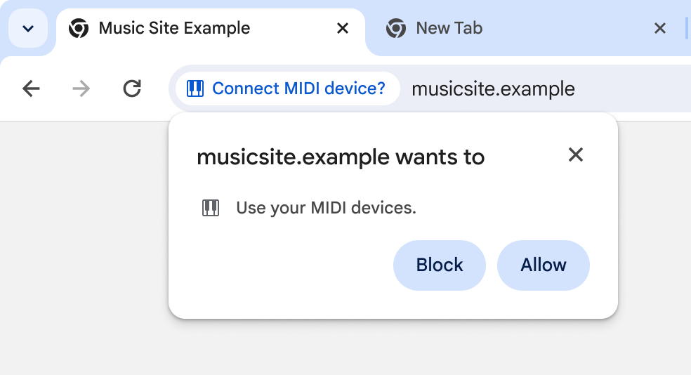
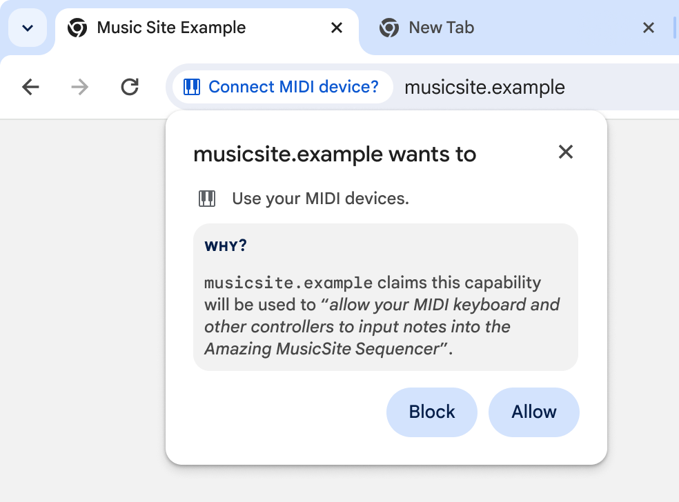
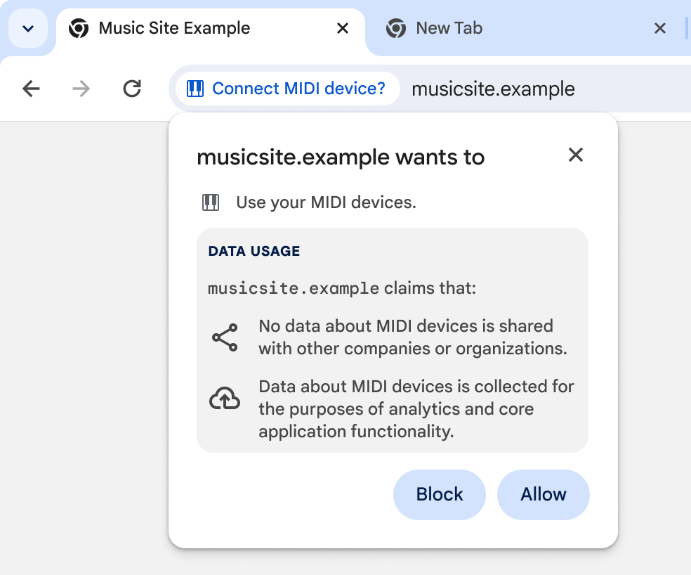

# Purposeful Permissions

## A Problem

Web developers can request access to powerful capabilities, and user agents generally pass these requests through to users so they can make decisions about what data a given site ought to be able to access. Today, these user-facing prompts are generally devoid of any useful context, presenting a user with a flat Block/Allow decision:



This kind of prompt takes responsibility for representing _what_ is being requested, but abdicates responsibility for explaining _why_ the request was made. It's difficult to expect users to make decisions without understanding how it might impact their experience on a given site, and we can likely do better than relying on the site's content to explain the upcoming decision and the rationale for it ahead of time.


## A Proposal

We should create a mechanism which allows developers to explain the purpose for which they're requesting access to powerful capabilities. This document suggests that we can learn something from [other][1] [platforms][2]' approaches to capability acquisition and [discussions at the W3C's 2022 Permission Workshop][13], and sketches a path for the web platform that seems worth exploring.

Whatever mechanism we land on, three goals seem useful to pursue:

1.  Users should understand the application-specific purpose to which a given capability will be put. This purpose is a critical part of any user's decision-making process as it (ideally) is directly relevant to their experience, and standardizing one mechanism for doing so would solidify the practice in developers' minds.

    Note: we should, of course, back these assertions up with research. [Section 7 of "Explanation Beats Context: The Effect of Timing & Rationales on Users’ Runtime Permission Decisions"][3] is a good place to start.

2.  Users should understand the backdrop of data usage practices that underlie the specific purpose for the request. It's reasonable to imagine that users might react differently to requests with similar direct purposes (e.g. "show your location on a map") when the set of possible ancillary uses differ (e.g. whether the data is linked to a user's identity).

3.  In a world in which users rely on sites' declarations when making decisions about how to engage with a site, it would be helpful for user agents to work to disincentivize requesting access for one purpose while using it for another. It should be possible, for instance, to publicize aggregations of sites' declared purposes through transparency reports. Ideally, it would also be possible for this information to be automatically discoverable to support researchers and other interested parties beyond user agents.

With these in mind, let's walk through a few approaches that could overlap and combine into a coherent story:

### Describing Application-Specific Purpose

To meet the first goal, developers could explain the application-specific purpose to which they plan to put a given capability in prose, enabling user agents to present this explanation to users in a way that could be relied upon when making a decision about whether to enable a given capability. The following illustrative mock could help explain (though, of course, should not be taken as in any way normative: UX design and research is necessary!):



Assuming we could find reasonable ways to present arbitrary strings to users (see [Generic Enumerations rather than arbitrary prose?](#user-content-generic-enumerations-rather-than-arbitrary-prose) below), developers could provide them in a number of ways. Here's a non-exhaustive list of technical approaches to consider:

#### Page-Specific Metadata

We could repurpose the `<meta>` element to support a declarative approach to sharing information with the user agent. We'd define a new metadata name (`capability-purpose`), support a new `features` attribute that held a space-separated list of [policy-controlled feature][4] names to which the declaration applied, and accept a `content` string:

```html
<meta name="capability-purpose"
      features="midi"
      content="allow your MIDI keyboard and other controllers to input
               notes into the Amazing MusicSite Sequencer">
```

This approach has the advantage of being fairly simple to implement, both for user agents and developers, and doesn't require any changes to existing web platform APIs. It does require the element's presence on any page that might request a given permission, which might be a burden.


#### Origin-wide Metadata

These declarations could be extracted out into a static, `.well-known` JSON file containing a set of declarations for all the policy-controlled features which an origin might wish to use:

```js
// e.g. `/.well-known/capability-purposes`
{
  "features": {
    ...,
    "midi": {
      "de-DE": "Ihrem MIDI-Keyboard und anderen Controllern die Eingabe von
                Noten zu ermöglichen",
      "en-US": "allow your MIDI keyboard and other controllers to input
                notes into the Amazing MusicSite Sequencer",
      ...
    },
    ...
  }
}
```

This approach can be more comprehensive, while remaining conceptually simple to implement. To reduce needless HTTP requests, this approach might benefit from some indication from the page that such a file is available, which might justify a new [link type][5], like:

```html
<link rel="capability-purposes" href="/.well-known/capability-purpose">
```

This approach is particularly relevant to the third goal above, as it supports automated discovery of the capabilities a site uses and the purposes to which they're put, and therefore supports various potential strategies for promulgating a sites' promises widely and holding them to account.


#### Imperative Call-time Metadata

It also seems possible to adjust capabilities' API signatures to accept this data as part of an options bundle. This is conceptually straightforward in cases where the API already accepts a dictionary that can be easily extended with a `purpose` member:

```js
navigator.requestMIDIAccess({
  sysex: false,
  purpose: "allow your MIDI keyboard and other controllers to
            input notes into the Amazing MusicSite Sequencer"
});
```

This mixes content and behavior in a way that's a little odd, and I18N might be slightly harder here than with text in an HTML document that's presumably already internationalized. It otherwise seems to have similar properties to the `<meta>` version above. it would require more work across a number of specifications and their implementations, but it's a plausible approach.


#### Declarative Call-time Metadata

Assuming something similar to the [Page Embedded Permission Control proposal][6] exists, purposes would be a straightforward extension, similar conceptually to the `<meta>` approach above:

```html
<permission type="midi"
            ...
            purpose="allow your MIDI keyboard and other controllers to
                     input notes into the Amazing MusicSite Sequencer">
```

### Generic Enumerations rather than arbitrary prose?

The examples and mock above all assume that developers would provide arbitrary text. This, of course, is dangerous, as we've generally assumed that any text developers can put into trusted surfaces will be abused (see [the beforeunload event handler][7], for example). If we can find a reasonable way to help users understand that the message is being passed through from the site, the benefits might outweigh the risks, but this will require some research and probably clever UX approaches beyond the mock above. It seems likely that such an explanation is possible, or that [browsers could learn to make good decisions][8] about when text could be useful or abusive, but let's assume for a moment that it's not. If we can't have strings, are there other options?

Two come to mind:

1. We could still achieve some portion of application-specific purpose declaration by enumerating a set of well-known use cases for each capability. It's unlikely that we'd be able to cover the breadth of reasonable usage in detail (let alone esoteric use cases), but at a high-enough level it seems likely that we could cover a reasonable subset of the purposes to which sites generally put a reasonable subset of capabilities. Rather than passing a string into the `purpose` members/attributes in the examples above, developers would specify an enum value (e.g. `purpose="update-midi-device-firmware"`), and the user agent would take it from there (mapping this string to "update the firmware of your MIDI device", for example).

2. We can achieve a substantial portion of the more generalized data usage practices by going even higher-level, shifting from the specifics of a capability to the general purposes to which capabilities are put. [Other][9] [platforms][10] have paved the way here to some extent, specifying a set of generic purposes that could be applied to a variety of data types ("advertising", "analytics", "app functionality", etc). These might lend themselves to a "nutrition label" kind of approach that shifts away from a detailed description of purpose to something that might lend itself to iconography while still being meaningful.

Enumerations, particularly the high-level kind in #2 above, seem worth exploring even if we do decide that strings are defensible. It might be ideal to support both, with enumerations providing somewhat-standardized insights, and a string providing more details into how those high-level purposes apply to this application in particular. This could give the user agent more flexibility regarding the way it renders data, perhaps initially providing only a "nutrition label" rendering of the enumeration, and allowing the user to dig into additional site-provided information (strings or entire privacy policies) if they choose.



Again, research and analysis of other platform's experience would be helpful.


## FAQ


### How does this intersect with developer-provided explanations in page content?

We [tell][11] developers today that it's helpful to prepare their users to make a decision before popping up a permission prompt. Sites might tell users "Hey, I'm about to request camera/microphone access because you're entering a video call." via a modal dialog in the content area, and only pop up the permission request after the user confirms their intent. The proposal here doesn't change that recommendation, but is somewhat orthogonal to it, as a single string in the permission prompt is unlikely to be as helpful as a full story a developer can tell in context.

I see these as two parts of the same story: whatever interface the browser provides is likely to be useful to both users and developers, but doesn't seem like a complete story in itself. Likewise, the work a developer can do in the page content to help prepare a user for a decision will make the prompt (and its new content) more effective.


### This proposal focuses on _why_ a prompt is shown. What about _when_?

Currently, user agents have adopted a model in which a site asks for a capability, and the request is more-or-less immediately passed through to the user to solicit a decision. While this proposal punts on that concern entirely, proposals like [Page Embedded Permission Control][6] aim to provide developers with options that are more respectful of users' time and attention.


### Why would developers use this mechanism?

Two reasons:

1. Declaring a purpose should allow developers to more clearly provide users with context for any given request, and there's an inference we can make from research in this area that this added context will increse user understanding, and drive grant rates up for reasonable requests.

2. User agents should consider using purpose declarations as part of the heuristics used to determine whether or not to grant a given capability to a given site. If sites don't explain themselves, it might be reasonable to  [more quietly render][12] their requests, or to require a stronger signal of interest from users before granting privilege.


[1]: https://developer.apple.com/documentation/uikit/protecting_the_user_s_privacy/requesting_access_to_protected_resources#:~:text=in%20Entitlements.-,Provide%20a%20purpose%20string,-The%20first%20time
[2]: https://developer.android.com/training/permissions/explaining-access#privacy-dashboard
[3]: https://www.usenix.org/system/files/sec21-elbitar.pdf#page=13
[4]: https://www.w3.org/TR/permissions-policy-1/#policy-controlled-feature
[5]: https://html.spec.whatwg.org/multipage/links.html#linkTypes
[6]: https://github.com/andypaicu/PEPC/blob/main/explainer.md
[7]: https://groups.google.com/a/chromium.org/g/blink-dev/c/YIH8CoYVGSg/m/Di7TsljXDQAJ
[8]: https://blog.google/products/chrome/building-a-more-helpful-browser-with-machine-learning/#:~:text=More%20peace%20of%20mind%2C%20less%20annoying%20prompts
[9]: https://developer.apple.com/app-store/app-privacy-details/#:~:text=types%20not%20mentioned-,Data%20use,-You%20should%20have
[10]: <https://support.google.com/googleplay/android-developer/answer/10787469?hl=en#zippy=%2Cpurposes:~:text=to%20all%20apps)-,Data%20types%20and%20purposes,-Click%20on%20the>
[11]: https://developer.chrome.com/blog/one-time-permissions/#best-practices
[12]: https://blog.chromium.org/2020/01/introducing-quieter-permission-ui-for.html
[13]: https://www.w3.org/Privacy/permissions-ws-2022/report#transparency-and-auditing
